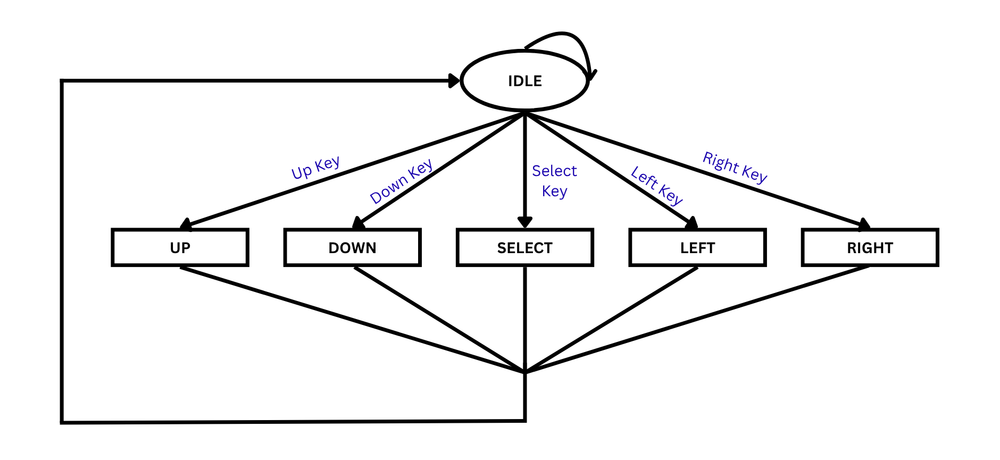

## Project Overview

This Arduino project implements a **finite state machine** (FSM) to enter and verify a secret code using an LCD display and navigation buttons.  
The user can navigate through characters, change them, and submit their final sequence. If the entered code matches the predefined one, a success message is displayed; otherwise, the system resets for another attempt.

---

## Finite State Machine

The FSM is designed with clear states to handle user input:

- **IDLE** – Waiting for a button press.
- **UP** – Change the current character to the previous letter in the alphabet (A → Z).
- **DOWN** – Change the current character to the next letter in the alphabet (Z → A).
- **LEFT** – Move the cursor to the left.
- **RIGHT** – Move the cursor to the right.
- **SELECT** – Check if the entered sequence matches the correct code.

---

### FSM Diagram

---

## How It Works

1. On startup, the LCD shows **ENTER CODE:** and a series of `*` representing hidden characters.
2. The **UP** and **DOWN** buttons change the character at the cursor’s position.
3. The **LEFT** and **RIGHT** buttons move the cursor position.
4. Pressing **SELECT** on the last position (with the checkmark symbol) verifies the code:
   - **Correct code** → Displays **YOU DID IT!**
   - **Wrong code** → Displays **WRONGGG >:(** and resets the entry field.
5. All input handling and state transitions are managed by the `task()` function.

---

## Demonstration

### Success Case

### Failure Case

